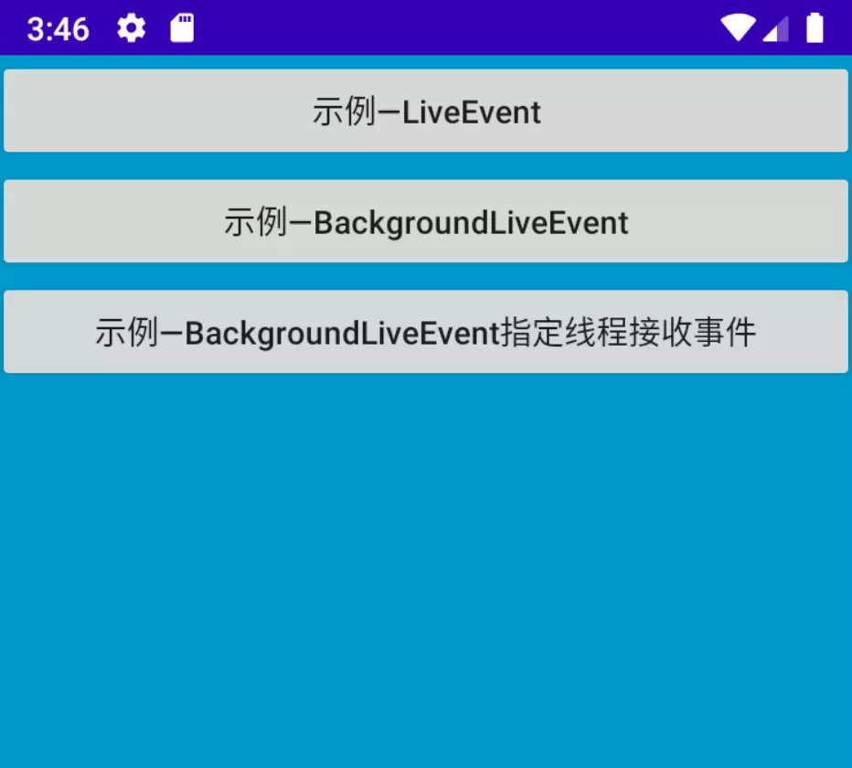

live-event
==========

[](https://jitpack.io/#wangdaqi77/live-event) [](https://www.apache.org/licenses/LICENSE-2.0)

一个在给定的生命周期内可观察的事件库。

它主要包含以下两个类：
 * `LiveEvent` - 一个在给定的生命周期内可观察的事件持有类，它继承`LiveData`，`setValue`和`observe`相关函数必须在主线程调用。
 * `BackgroundLiveEvent` - 一个在给定的生命周期内可观察的事件持有类，`setValue`和`observe`相关函数支持在任意线程调用，它默认在后台线程接收事件，也可以指定线程接收事件。

如果[直接使用请点这里](#开始使用)，后续再来阅读文档。

前言
----
Jetpack中的`LiveData`是一个在给定的生命周期内可观察的数据持有类，它在主线程管理和分发数据，它为容纳`ViewModel`中的各个数据字段而设计，`ViewModel`的唯一职责是管理UI数据，因此目前`LiveData`主要是作为UI的唯一信任源，用于数据驱动UI。

`LiveData`为数据驱动UI而设计，但是它不适用于事件场景。

那么，`LiveData`为数据驱动UI而设计，体现在哪里？？

我们通过`liveData.observe(lifecycleOwner, observer)`感受LiveData的强大之处：
 * `liveData`会感知`lifecycleOwner`所提供的生命周期以自动管理`observer`的活跃状态、注册、反注册，这样能帮助开发者自动回收资源，避免内存泄漏和异常情况，提升了性能。
 * 当`liveData`第一次感知到`lifecycleOwner`活跃时，`liveData`会粘一个最新的数据通知到该`observer`，这样保证了UI与数据的一致性。
 * 当`liveData`感知到`lifecycleOwner`处于非活跃后，依次调用`liveData.setValue(a)`、`liveData.setValue(b)`，`liveData.setValue(n)`，`observer`一定会丢掉`n`之前的数据，这样在非活跃后能避免不必要的UI绘制。
 * 当`liveData`感知到`lifecycleOwner`处于活跃时，在一个子线程依次调用`liveData.postValue(a)`、`liveData.postValue(b)`，`liveData.postValue(n)`，`liveData`可能会丢掉`a`，也可能会丢掉`b`，`liveData`只保证将最新的`n`通知到`observer`，这样能避免不必要的UI绘制提升了效率和性能。
 * 当`liveData`感知到`lifecycleOwner`处于活跃时，调用`liveData.setValue(a)`，此时`observer`收到`a`并在onChanged调用`liveData.setValue(b)`，这种"嵌套"会导致在`observer`注册后注册的Observer收不到`a`只会收到`b`，这样能避免不必要的UI绘制提升了效率和性能。

`LiveData`的优秀设计产生了**粘性行为**和**丢弃行为**，它们并不适用于某些观察事件场景：
 * 当`liveData`第一次感知到`lifecycleOwner`活跃时，`observer`立即接收一个最近的数据/事件，这个场景称为**粘性行为**，在某些场景下这不可接受。
 * 当`liveData`感知到`lifecycleOwner`处于非活跃后，依次调用`liveData.setValue(a)`、`liveData.setValue(b)`，`liveData.setValue(n)`，`observer`一定接收不到`a`和`b`，这个场景称为非活跃的**丢弃行为**，在某些场景下这不可接受。
 * 当`liveData`感知到`lifecycleOwner`处于活跃时，在一个子线程依次调用`liveData.postValue(a)`、`liveData.postValue(b)`，`liveData.postValue(n)`，`observer`可能接收不到`a`，也可能接收不到`b`，这个场景称为多次postValue**丢弃行为**，在某些场景下这不可接受。
 * 当`liveData`感知到`lifecycleOwner`处于活跃时，调用`liveData.setValue(a)`，此时`observer`收到`a`并在onChanged调用`liveData.setValue(b)`，这种"嵌套"会导致在该`observer`后面注册的`Observer`收不到`a`只会收到`b`，这个场景称为setValue嵌套**丢弃行为**，在某些场景下这不可接受。
 * 它不能在指定的线程观察数据/事件。

`LiveData`中的`observe`和`observeForever`方法既有**粘性行为**又有**丢弃行为**，本文中提到的**粘性行为**和**丢弃行为**都是围绕这这两个方法进行阐述的。

为事件而生
---------
`LiveEvent`是`LiveData`的子类，它保留了感知生命周期的能力，新增了没有粘性行为和没有丢弃行为的相关观察方法。

`BackgroundLiveEvent`适用于在后台线程发送和观察事件，保持了与`LiveEvent`一致的方法名，使用`BackgroundObserver`可以指定线程接收事件。

LiveEvent和BackgroundLiveEvent的相关观察方法：
| 观察方法                   |感知生命周期|没有粘性行为|没有丢弃行为|备注|
| :---                              |:---:      |:---:   |:---:      |:---|
| `observe`                         |✔️       |❌        |❌         |与LiveData中的observe观察行为一致|
| `observeForever`                  |❌          |❌        |❌         |与LiveData中的observeForever观察行为一致|
| `observeNoSticky`                 |✔️       |✔️     |❌         |相比`observe`，没有粘性行为|
| `observeForeverNoSticky`          |❌          |✔️     |❌         |相比`observeForever`，没有粘性行为|
| `observeNoLoss`                   |✔️       |❌        |✔️      |相比`observe`，没有丢弃行为|
| `observeForeverNoLoss`            |❌          |❌        |✔️       |相比`observeForever`，没有丢弃行为|
| `observeNoStickyNoLoss`           |✔️       |✔️     |✔️       |相比`observe`，既没有粘性行为，又没有丢弃行为|
| `observeForeverNoStickyNoLoss`    |❌          |✔️     |✔️       |相比`observeForever`，既没有粘性行为，又没有丢弃行为|

**关于没有丢弃行为的观察方法：**
 * 当调用`liveEvent.observeNoLoss(lifecycleOwner, observer)`，丢弃行为中丢弃的事件会有序的保存到`observer`关联的临时链表中，等待**适当的时机**将该链表中的事件有序的通知到`observer`。
 * **适当的时机**是什么时候？
    1. 当调用`liveEvent.observeNoLoss(lifecycleOwner, observer)`观察事件，这个时机是`liveEvent`感知到`lifecycleOwner`从非活跃变成活跃时，如`Activity`从后台返回到前台。
    2. 当调用`liveEvent.observeNoLoss(lifecycleOwner, observer)`观察事件，并且`liveEvent`感知到`lifecycleOwner`是活跃的，在一个子线程依次调用`liveEvent.postValue(a)`、`liveEvent.postValue(b)`，`liveEvent.postValue(n)`，丢弃行为中丢弃的事件会有序的保存到`observer`关联的临时链表中，这个时机是`liveEvent`内部触发调用`setValue(n)`时。
 * 如果`lifecycleOwner`处于非活跃状态后事件频繁，且事件对象占用内存较大，因此请根据应用场景选用`observeForeverNoLoss`或`observeForeverNoStickyNoLoss`。

开始使用
=======

依赖
----
```
repositories {
    maven { url 'https://jitpack.io' }
}

dependencies {
    implementation "com.github.wangdaqi77.live-event:core:1.5.6"
    // 务必依赖官方组件
    implementation "androidx.lifecycle:lifecycle-core:2.3.1"
}
```

使用示例
-------
创建一个包含一个初始事件的`liveEvent`，以多种方式进行观察，然后通过`postValue(A)`、`postValue(B)`发送事件，查看观察行为的不同之处：
```kotlin
// 1.创建
val liveEvent = MutableLiveEvent<String>(EVENT_INIT) 
// val liveEvent = MutableLiveEvent<String>(EVENT_INIT)

// 2.以多种方式进行观察
// 与LiveData的observeForever观察行为一致
liveEvent.observeForever(Observer { event ->
   // 将依次接收到EVENT_INIT，"事件B"
})

// 相比observeForever，没有粘性行为
liveEvent.observeForeverNoSticky(Observer { event ->
   // 只接收到"事件B"
})

// 相比observeForever，没有丢弃行为
liveEvent.observeForeverNoLoss(Observer { event ->
   // 将依次接收到EVENT_INIT，"事件A"，"事件B"
})

// 相比observeForever，没有粘性行为且没有丢弃行为
liveEvent.observeForeverNoStickyNoLoss(Observer { event ->
   // 将依次接收到"事件A"，"事件B"
})

// 3.通过postValue发送事件
liveEvent.postValue("事件A")
liveEvent.postValue("事件B")
```

BackgroundLiveEvent可以指定线程接收事件
```kotlin
// 1.创建一个在后台线程接收事件的BackgroundLiveEvent，它包含一个初始事件
val liveEvent = MutableBackgroundLiveEvent<String>(EVENT_INIT)

// 2.观察
// 2.1 使用BackgroundObserver观察时，会在BackgroundLiveEvent内置的事件调度器所属的唯一子线程接收事件。
liveEvent.observe(LifecycleOwner, BackgroundObserver { event ->
   // 线程名为event-dispatcher-default
   // 不建议在此做耗时操作
})

// 2.2 BackgroundObserver还可以指定一个事件分发器，用于指定后台线程接收事件
// EventDispatcher.BACKGROUND
liveEvent.observe(LifecycleOwner, BackgroundObserver(EventDispatcher.BACKGROUND) {
  // 线程名为event-dispatcher-background
  // 不建议在此做耗时操作
})

// EventDispatcher.ASYNC
liveEvent.observe(LifecycleOwner, BackgroundObserver(EventDispatcher.ASYNC) { 
  // 线程名为pool-async-event-dispatcher-thread-xx
  // 可在此做耗时操作
})

// EventDispatcher.MAIN（Android主线程）
liveEvent.observe(LifecycleOwner, BackgroundObserver(EventDispatcher.MAIN) {
  // 线程名为main
  // 不建议在此做耗时操作
})

// custom
liveEvent.observe(LifecycleOwner, BackgroundObserver(dispatcher = yourCustomDispatcher) { 
  // 线程名为yourCustom
})
```

混淆
----
```
-dontwarn androidx.lifecycle.LiveData
-keep class androidx.lifecycle.LiveData { *; }
-dontwarn androidx.lifecycle.LifecycleRegistry
-keep class androidx.lifecycle.LifecycleRegistry { *; }
```

Demo
====
Demo提供了丰富的示例，[下载Demo](./assets/demo-debug.apk)了解更多

Demo主界面：


